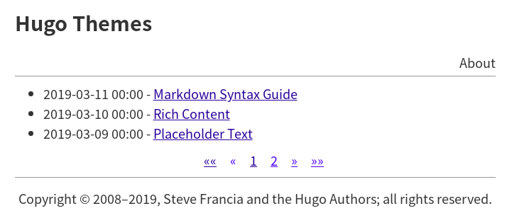

# Demo of Hugo Theme 'simple-style'

This repository offers an example site for my [Hugo](https://gohugo.io/) theme '[simple-style](https://github.com/yanlinlin82/simple-style)'.

[Click here](https://yanlinlin82.github.io/simple-style-demo/) to show the online demo.

# Usage

1. Download the source code from github:

```sh
cd /path-to-hugo-site/
mkdir -p themes/
git clone https://github.com/yanlinlin82/simple-style themes/simple-style/
```

2. Edit `config.toml`, add the following line:

```
theme = "simple-style"
```


# Screenshots

<br>
<br>
<br>
